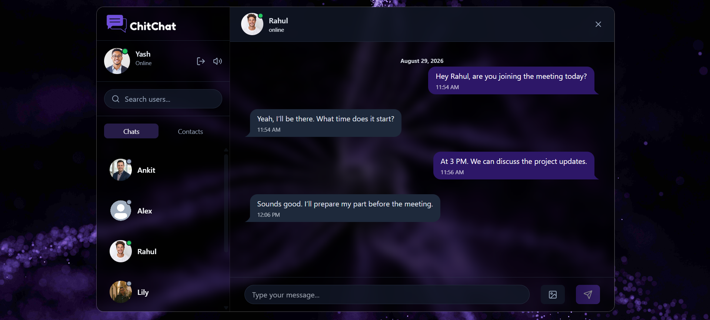
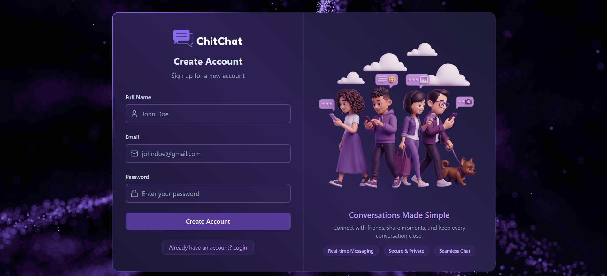
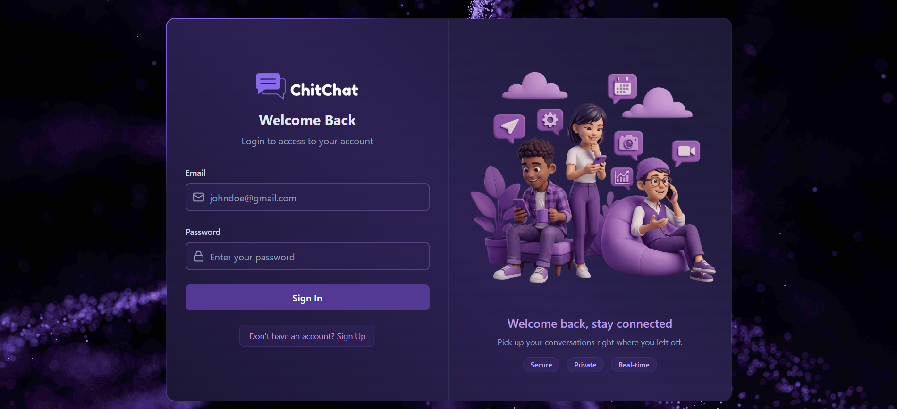
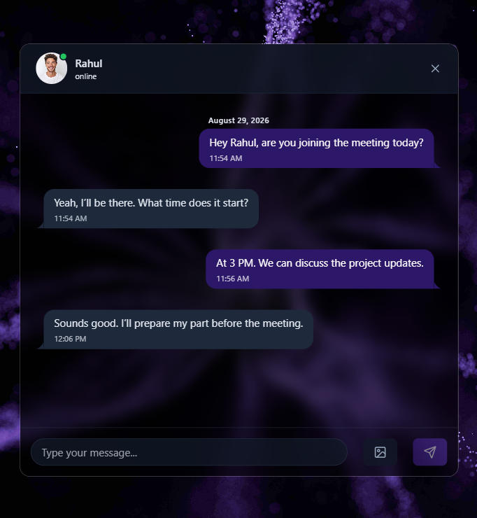

# 💬 ChitChat — Frontend

A modern and responsive **real-time chat application** built with React.js, designed for fast and seamless one-to-one communication.

---

## 📸 Screenshots

### Chat Interface



### Login



### Sign Up



### Mobile View



---

## 📌 Overview

**ChitChat** is a real-time messaging application with a responsive interface for one-to-one communication.

The frontend focuses on a smooth messaging experience with real-time updates, image sharing, search functionality, authentication, sound controls, and responsive design.

---

## ✨ Features

* 💬 **Real-Time Messaging** — Send and receive messages instantly.
* 🖼️ **Image Sharing** — Send images directly within conversations.
* 🔊 **Sound Controls** — Enable or disable chat notification sounds.
* 🔎 **Search & Filtering** — Search contacts and conversations quickly.
* 🟢 **Online / Offline Status** — View users' current availability.
* ⚡ **Optimistic UI** — Messages appear immediately for a smoother experience.
* 🔐 **Secure Authentication** — JWT authentication using HttpOnly cookies.
* 🚫 **Custom 404 Page** — Handles invalid and unavailable routes.
* 📱 **Responsive Design** — Optimized for desktop and Android browsers.

---

## 🛠️ Tech Stack

| Technology                 | Purpose                       |
| -------------------------- | ----------------------------- |
| **React.js**               | User interface                |
| **Vite**                   | Development and build tooling |
| **React Router**           | Client-side routing           |
| **Zustand**                | State management              |
| **Axios**                  | API communication             |
| **Socket.IO Client**       | Real-time communication       |
| **Tailwind CSS**           | Styling                       |
| **DaisyUI**                | UI components                 |
| **Motion / Framer Motion** | Animations                    |
| **Lucide React**           | Icons                         |

---

## 🔐 Authentication

ChitChat uses **JWT authentication with HttpOnly cookies**.

The authentication token is stored in an HttpOnly cookie, preventing client-side JavaScript from directly accessing the token.

The frontend communicates with the backend using authenticated requests and credentials.

---

## ⚡ Real-Time Communication

The application uses **Socket.IO Client** for real-time communication with the backend.

This enables:

* Instant message delivery
* Online/offline presence
* Real-time conversation updates

---

## 🔎 Search & Filtering

ChitChat provides search functionality for both **contacts and conversations**.

When no matching results are found, the application displays an appropriate empty state instead of leaving the interface blank.

---

## 🖼️ Image Sharing

Users can select and send images directly within conversations.

The interface supports image previews and displays uploaded images directly inside the chat.

---

## 🔊 Sound Controls

Users can enable or disable chat notification sounds.

The selected sound preference is stored locally and persists between sessions.

---

## ⚡ Optimistic UI

ChitChat uses **optimistic UI updates** when sending messages.

Messages are displayed immediately while the request is processed by the backend, creating a faster and more responsive messaging experience.

---

## 🌐 Browser Compatibility

ChitChat currently works best on:

* ✅ Windows / Desktop browsers
* ✅ Android browsers
* ⚠️ Safari — currently limited

Safari has stricter cross-site cookie and privacy behavior, which can affect authentication when the frontend and backend are deployed separately.

---

## 🚀 Getting Started

### Prerequisites

Make sure you have installed:

* **Node.js**
* **npm**

### 1. Clone the repository

```bash
git clone https://github.com/yourusername/chitchat-frontend.git
```

### 2. Navigate to the project

```bash
cd chitchat-frontend
```

### 3. Install dependencies

```bash
npm install
```

### 4. Start the development server

```bash
npm run dev
```

The application will be available at:

```text
http://localhost:5173
```

---

## 📦 Production Build

Create an optimized production build:

```bash
npm run build
```

Preview the production build locally:

```bash
npm run preview
```

---

## 🔗 Backend

The frontend communicates with a separate backend that handles server-side functionality including authentication, messaging, user management, image uploads, and email services.

**Backend Repository:**
https://github.com/yourusername/chitchat-backend

---

## 📁 Project Structure

```text
src/
├── components/
├── pages/
├── hooks/
├── store/
├── lib/
├── App.jsx
└── main.jsx
```

---

## 👨‍💻 Author

**Yash Singhal**

ChitChat was built as a hands-on full-stack project to gain practical experience with modern frontend development, real-time communication, authentication, state management, responsive UI, and production deployment.

---

## 📄 License

This project is licensed under the [MIT License](LICENSE).

Copyright © 2026 Yash Singhal.
